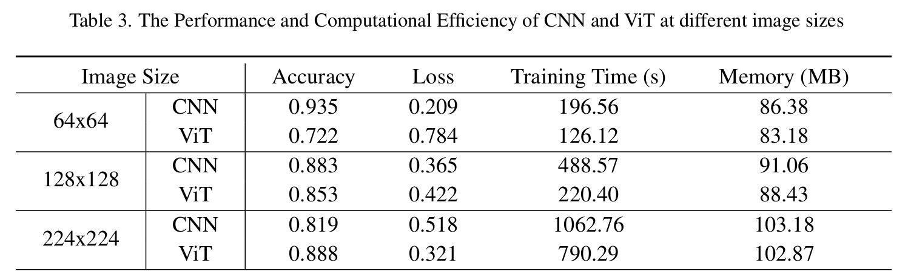
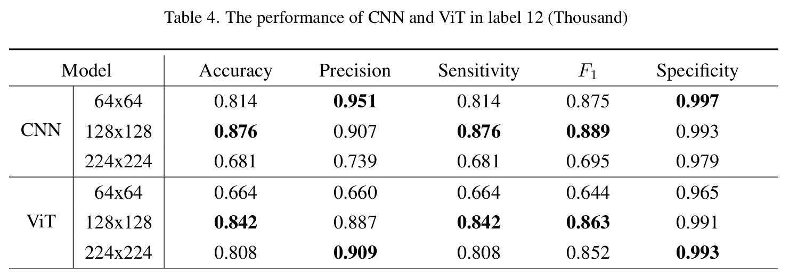

# AI_Course_Assessment
## Title: Exploring the CNN and ViT in Chinese MNIST
## Dataset: https://www.kaggle.com/datasets/gpreda/chinese-mnist/data

******
## How to Use
### Requirements:
* python=3.8
* cuda=11.8
```bash
conda create -n Assessment python=3.8
conda activate Assessment
pip install -r requirements.txt
```
#### Train CNN and ViT
`python five_fold_cross_validation.py`

#### Get precision, recall, F1 and so on
`python get_avg_metrics.py`

#### Get accuracy, loss, training time, memory usage
`python get_training_data.py`

#### Get confusion matrix
`python get_confusion_matrix.py`
```python
python five_fold_cross_validation.py # train CNN and ViT
python get_avg_metrics.py # get precision, recall, F1 and so on
python get_training_data.py # get accuracy, loss, training time, memory usage
```
****

## Models
### Super Parameters:
1. **Epoch** = 10
2. **Learning Rate** = 0.0001
3. **Batch Size** = 64
4. **Train Size : Test Size** = 4 : 1
<!DOCTYPE html>
<html lang="zh-CN">
<body>
  <div style="display: flex; justify-content: space-around;">
    
    
  </div>
</body>
</html>

****
## Results
### 1. Params and FLOPs
|Model|Image Size|Parameters(M)|FLOPs(G)|
|-----|----------|-------------|--------|
||64x64||5.05|
|CNN|128x128|4.44|20.21|
||224x224||61.90|
||64x64||0.277|
|ViT|128x128|4.27|1.095|
||224x224||3.334|
### 2. Acc and Loss


### 3. Detail metrics in recognizing complex label 12(Thousand)

### 4. Confusion Matrix
#### 4.1. CNN
  
#### 4.2. ViT


