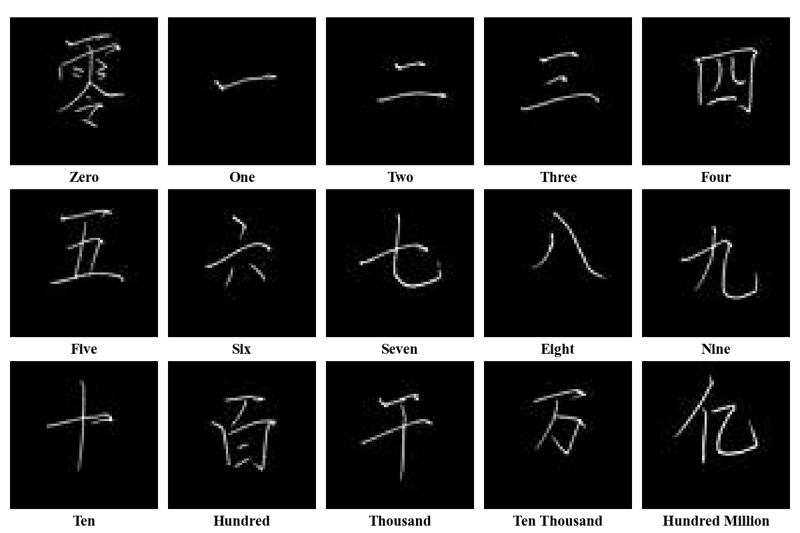
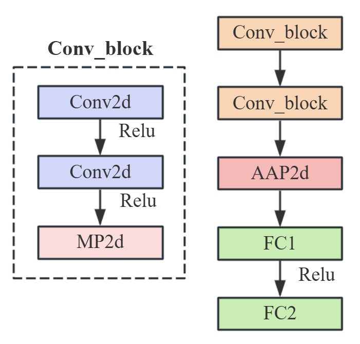
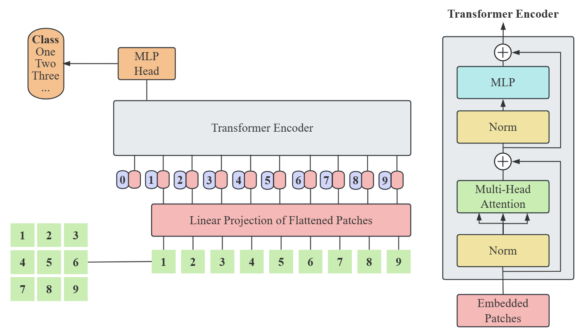
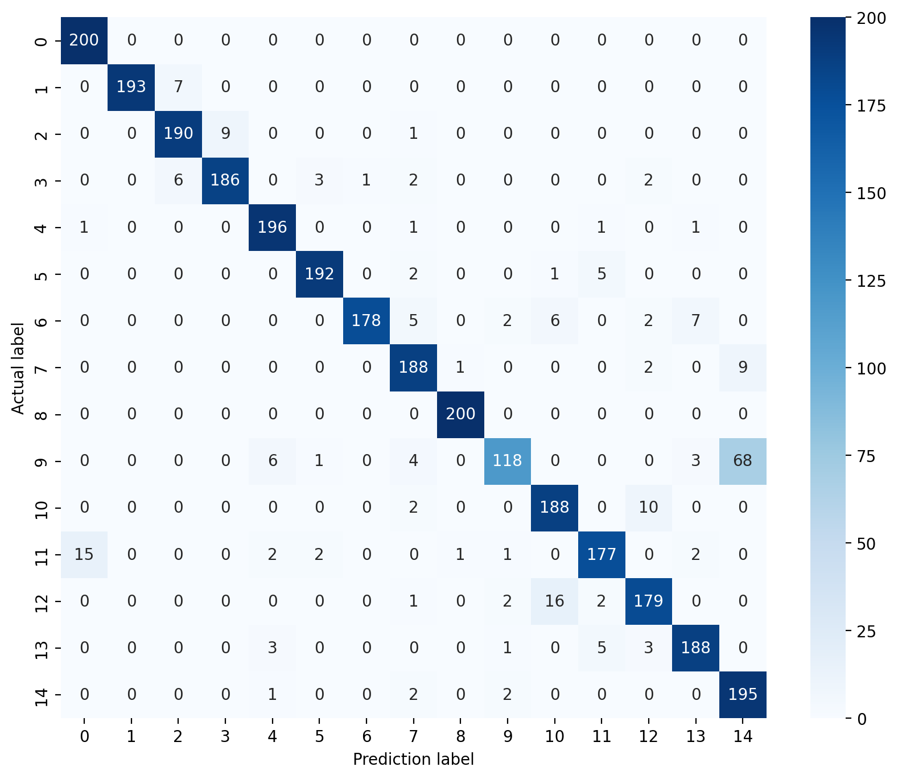
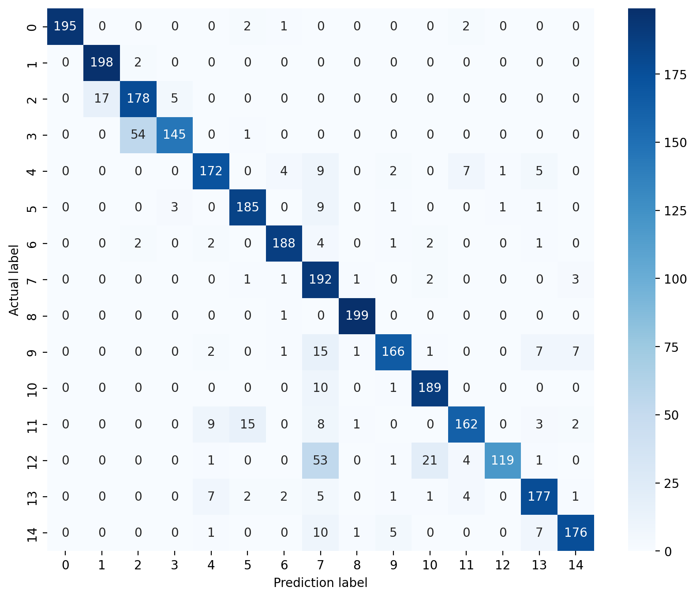

# AI_Course_Assessment
## Title: Exploring the CNN and ViT in Chinese MNIST
## Dataset: https://www.kaggle.com/datasets/gpreda/chinese-mnist/data


## Models
<!DOCTYPE html>
<html lang="zh-CN">
<body>
  <div style="display: flex; justify-content: space-around;">
    
    
  </div>
</body>
</html>

## How to Use
### Requirements:
* python=3.1.0
* cuda=
### Super Parameters:
1. **Epoch** = 10
2. **Learning Rate** = 0.0001
3. **Batch Size** = 64
4. **Train Size : Test Size** = 4 : 1
```python
python five_fold_cross_validation.py # train CNN and ViT
python get_avg_metrics.py # get precision, recall, F1 and so on
python get_training_data.py # get accuracy, loss, training time, memory usage
```


## Results
### Params and FLOPs
|Model|Image Size|Parameters(M)|FLOPs(G)|
|-----|----------|-------------|--------|
||64x64||5.05|
|CNN|128x128|4.44|20.21|
||224x224||61.90|
||64x64||0.075|
|ViT|128x128|4.24|0.286|
||224x224||0.868|
### Acc and Loss (待更新)
#### CNN (learning rate = 0.001)
| Fold | 平均Train Loss | 平均Train Acc | 平均Val Loss | 平均Val Acc |
|------|----------------|----------------|--------------|--------------|
| 1    | 0.84819        | 74.783%        | 0.56143      | 82.079%      |
| 2    | 0.86031        | 73.231%        | 0.55212      | 82.479%      |
| 3    | 0.94134        | 72.042%        | 0.61852      | 80.833%      |
| 4    | 1.33668        | 58.622%        | 0.96634      | 70.308%      |
| 5    | 0.82337        | 74.766%        | 0.51698      | 82.181%      |
#### ViT (learning rate = 0.0002)
| Fold | 平均Train Loss | 平均Train Acc | 平均Val Loss | 平均Val Acc |
|------|----------------|----------------|--------------|--------------|
| 1    | 1.38677        | 54.736%        | 1.17336      | 64.041%      |
| 2    | 1.27733        | 52.149%        | 1.08332      | 64.077%      |
| 3    | 1.15462        | 57.891%        | 1.01899      | 66.259%      |
| 4    | 1.26613        | 55.162%        | 1.08521      | 64.820%      |
| 5    | 1.28067        | 55.704%        | 1.03204      | 63.926%      |
### Training Time and Memory
|Model|Image Size|Training Time(s)|Memory(MB)|
|-----|----------|-------------|--------|
||64x64|184.24|86.16|
|CNN|128x128|463.61|91.66|
||224x224|1024.51|83.18|
||64x64|124.49|83.18|
|ViT|128x128|219.52|88.43|
||224x224|897.36|102.87|
### Confusion Matrix
#### CNN
  
如图所示
#### ViT

如图所示

